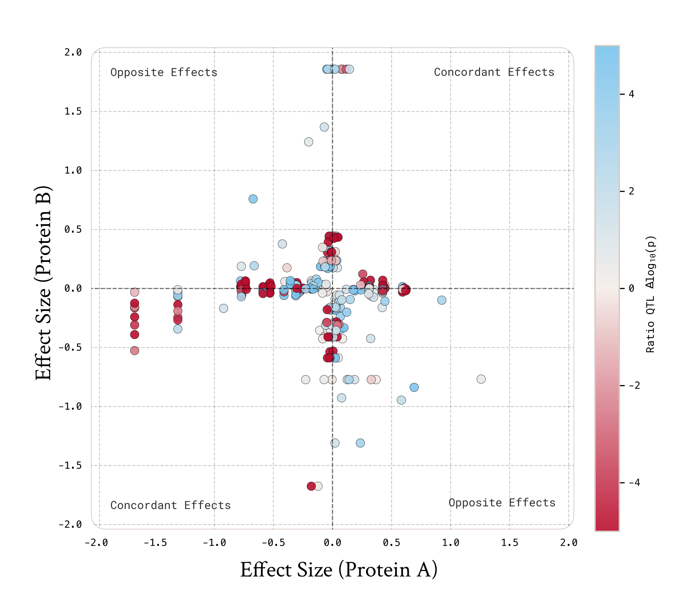

## The Logic Behind Protein Ratios

In this study, rather than analyzing protein abundances separately, we analyze ratios of protein pairs in a protein ratio-QTL (rQTL) framework. This approach is designed to increase the signal to noise ratio by canceling out any shared variance between protein pairs.

Suppose Protein A has a genetic signal but is buried in environmental noise, which can be either biological (e.g. inflammation) or technical. 
> ProteinA abundance = Genetics A + Inflammation

Meanwhile, Protein B has no genetic signal in that locus but is affected by the exact same noise, such as fluctuating similarly with inflammation.

> ProteinB abundance = Inflammation

When we take the log ratio, we subtract the shared environment:

> A/B Ratio = ProteinA – ProteinB = Genetics A + Inflammation – Inflammation = Genetics A

The result is a genetic signal, stripped of the biological noise that previously suppressed it.

::: details Why does this work?
Measurement "noise", such as inflammation or sample handling, doesn't just add a fixed amount of protein but usually acts as a multiplier. If a sample is more concentrated or inflamed, it might double (×2) the levels of particular proteins in that sample.

> Protein A abundance = Genetics A×Noise

Protein abundances are measured on a Log2 scale. This is crucial because the log of a product is the sum of its parts.

> log(Protein A abundance) = log(Genetics A×Noise) = log(Genetics A)+log(Noise)

The "log of a ratio" is the same as subtraction: 

> log(A/B)=log(A)−log(B)

Because the noise is now an additive term, if noise is shared between two proteins, subtracting erases it completely.

> log(Protein A abundance)/log(Protein B abundance) = log(Genetics A×Noise)/log(Noise) = (Genetics+Noise)−(Noise) = Genetics A
:::

When comparing the association strength (p-value) of a protein ratio (rQTL) against the same genetic variant’s single-protein baseline (pQTL), results fall into three distinct scenarios:

### 1. Signal Dilution (Both Decrease)

The two proteins are biologically unrelated and share little non-genetic variance. By creating a ratio, the unique noise of the second protein is introduced without adding any corresponding genetic signal. This dilutes the genetic signal of the first protein with the noise of the second, and vice versa, reducing statistical power to detect either signal. 

This represents the majority of random protein pairings.

### 2. Asymmetric Gain (Mixed)

The ratio improves the association strength for one protein while decreasing it for the other. The reference protein acts as a proxy for non-genetic variance, reducing the residual variance for the other protein measurement. While this signal cleaning effect improves the power to detect one of the genetic signals, the reverse correction fails due to the reverse signal containing its own unique noise that does not correlate with the reference protein.

Rather than a direct biological interaction between the variant and both proteins, this scenario is interpreted as noise correction. 

### 3. Symmetric Gain (Both Increase)

The ratio rQTL association is significantly stronger than the single-protein pQTL associations for both components. This is highly indicative of a biological interaction or a shared biochemical pathway. Two mechanisms lead to this symmetric boost in power:

**Shared Noise Cancellation (Independent Signals):**
Proteins rarely function in isolation. Instead, they fluctuate together in response to shared biological states, such as inflammation levels, cell counts, or metabolic processes. Therefore, even if the proteins are biologically distinct and regulated by different genes, they often share the same systemic variation. For example, if both Protein A and Protein B are regulated by the same immune pathway, their levels will rise and fall together across the population, masking the subtle effects of their specific genetic variants (cis-pQTLs). Once this shared biological background is removed, the genetic signals specific to either protein rise in significance.

**Opposing Genetic Effects:**
In rarer cases, the genetic variant affects both proteins but in opposite directions — increasing Protein A while decreasing Protein B. Because the genetic effects have opposite signs, the composite signal becomes stronger than either protein shows on its own. This would point to a direct functional relationship, such as a substrate-product pair where the variant affects the enzyme converting one to the other.

::: details Visualizing the Effect Direction and Signal Gain

This scatter plot confirms the opposing direction of the genetic effect as an important predictor of success for ratio analysis. Each dot represents a particular genome-wide significant genetic variant tested in a protein pair. The X-axis is the effect on Protein A and the Y-axis is the effect on Protein B. The color indicates the result: blue dots represent a gain in statistical signal for the rQTL (a stronger p-value), while red dots represent a loss or dilution of signal, when compared to the best pQTL in the ratio.

Significant rQTL (blue) cluster in the top-left and bottom-right "opposite sign" zones. Here, the genetic variant is linked with increasing one protein’s abundance while decreasing the other (e.g., Protein A goes up, Protein B goes down). As predicted in the Opposing Genetic Effects scenario above, when the genetics push the two proteins in opposite directions, the ratio amplifies this contrast, resulting in net signal gain.
:::