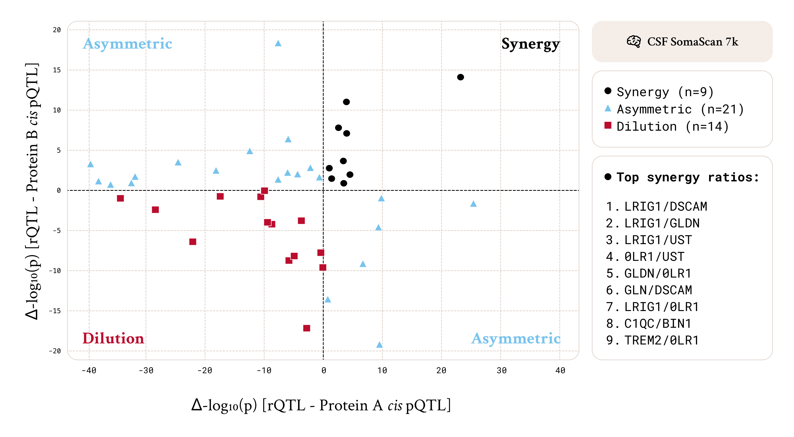

## Ratios of the Microglial Proteome

In this study, we compared rQTL results from cerebrospinal fluid and blood plasma, revealing a fundamental difference in how Alzheimer's disease-associated microglia proteins are regulated in their native environment (CSF) versus the periphery (blood plasma). The two cohorts share similar sample sizes (1,888 for CSF vs. 2,150 for plasma), identical European ancestry, and the same multiplex proteomic technology (SomaScan 7k). Furthermore, every protein measurement was genetically validated to possess a cis pQTL within its respective tissue. Despite these consistencies, the CSF results (*CSF graph*) demonstrate a highly interconnected proteomic network that is absent in plasma (*Plasma graph*). 

Of the 78 tested protein ratios in CSF, 30 (38%) showcase either symmetric or asymmetric gain in signal, indicating that in the central nervous system these proteins fluctuate in coordination with one another. Consequently, forming ratios in CSF frequently succeeds in removing shared biological "noise” (i.e. common inflammatory states or microglial activation levels), thereby increasing the power to detect these variants compared to single-protein analyses.

In sharp contrast, performing the same analysis in blood plasma (Graph B) exhibits a near-total collapse of this network structure. The plasma analysis had a greater set of potential targets testing 105 ratios, compared to 78 in CSF, given a higher number of protein measurements possessing single protein cis-variants (15 vs 13). Despite 8 of these 15 measurements overlapping between the two tissues, the ratios failed to improve the QTL signal strength in all but 3 instances (3%). Notably, 2 of these overlapped with CSF results and the ratio between the two separate TREM2 assays was not tested due to the lack of a cis signal in the secondary measurement. While strong single-protein signals exist in isolation in blood plasma, they do not share the systematic variance with other microglia proteins required for a ratio to generate a p-gain.

This suggests that while most microglial proteins are detectable in plasma, they likely originate as cellular leakage or uncoupled debris rather than as part of a coordinated biological response. In CSF, the proteins often behave as a system, where Protein A serves as a valid proxy for the environmental noise affecting Protein B. In plasma, these same proteins appear to fluctuate independently, governed by clearance rates or peripheral noise rather than shared regulation and disease pathways. Therefore, constructing ratios in plasma predominantly introduces the unique noise of the second protein without subtracting any shared variance, diluting the original genetic signals rather than enhancing them.
