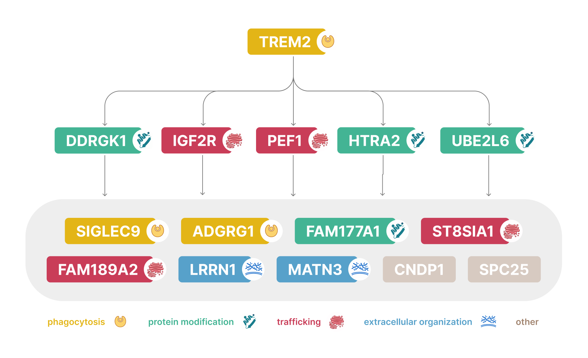

## Second-Stage Proteome-Wide rQTL Mapping Centered on TREM2

Each of the five candidate TREM2 partners was used as a new anchor and paired with every other measured protein. The same genome-wide significance and Bonferroni-corrected p-gain requirements used in the TREM2 screen were applied to each follow-up scan. The follow-up scans identified 59 significant ratios for DDRGK1, 87 for HTRA2, 92 for IGF2R, 38 for PEF1 and 23 for UBE2L6. After excluding TREM2 and the original candidate partners, 58, 86, 91, 37 and 22 proteins, respectively, remained for recurrence analysis. 
Most significant proteins were specific to an individual anchor, so the network visualization was restricted to the strict recurrent core. Four proteins—FAM177A1, LRRN1, SIGLEC9 and SPC25—formed significant rQTLs with all five anchors. A further five—MATN3, ST8SIA1, ADGRG1, CNDP1 and FAM189A2—were identified by four of the five anchors.

Based on functional annotation, 13 of the 15 displayed proteins aligned with four recurring biological themes. TREM2, SIGLEC9 and ADGRG1 were associated with phagocytosis; DDRGK1, HTRA2, UBE2L6 and FAM177A1 with protein modification; IGF2R, PEF1, ST8SIA1 and FAM189A2 with intracellular trafficking; and LRRN1 and MATN3 with extracellular organization. SPC25 and CNDP1 were not assigned to these four themes.

The proteins span several cellular compartments, including the plasma membrane, endosomal and secretory systems, mitochondria, cytoplasm and extracellular space. Their recurrence therefore does not define a single linear TREM2 pathway, but it suggests that independently selected rQTL anchors repeatedly connect TREM2-associated genetic variation to a focused set of related cellular functions. These relationships provide experimentally testable candidates for investigating the broader proteomic context of TREM2 biology.

