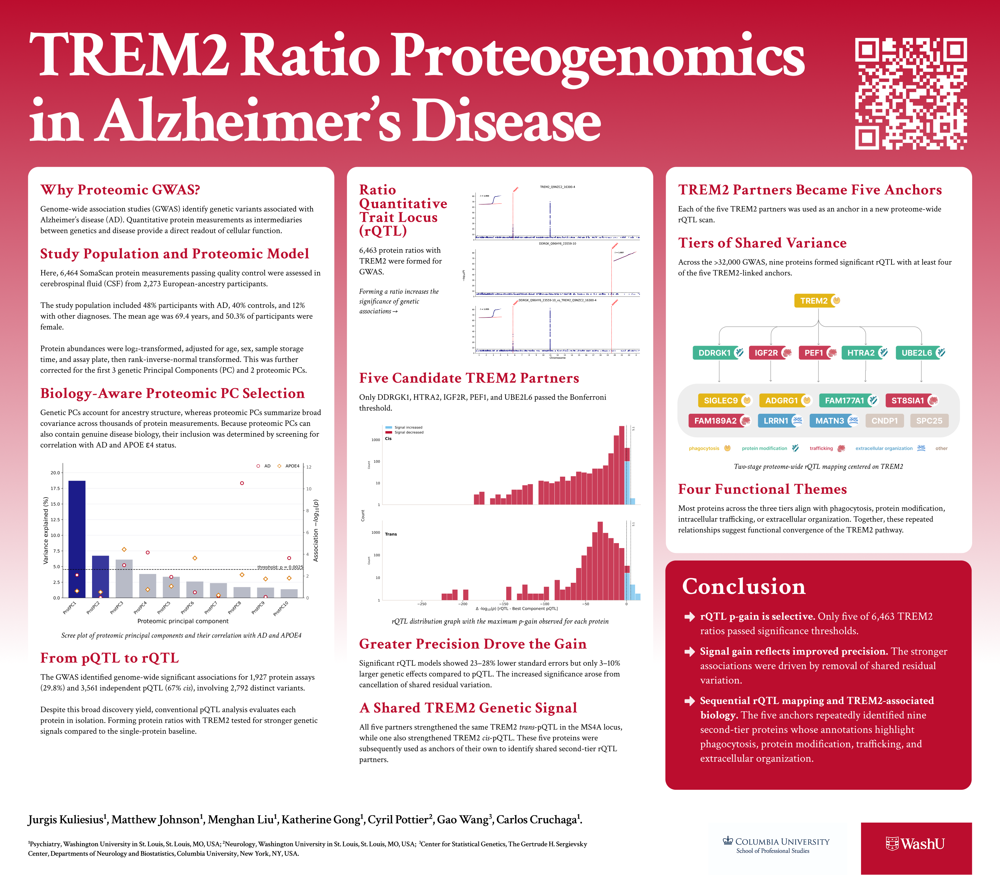

# About

This interactive resource accompanies Poster 0146: TREM2 Ratio Proteogenomics in Alzheimer's Disease, presented at the 2026 AAIC (Alzheimer's Association Internation Conference) in London.

The work was conducted by the Cruchaga Lab at Washington University in St. Louis. [Cruchaga Lab](https://cruchagalab.wustl.edu/)

**Lead Analyst:**  
Jurgis Kuliesius, PhD

**Principal Investigator:**  
Prof. Carlos Cruchaga, PhD

**Collaborators:**  
Gao Wang, PhD (Asst. Prof, Columbia University) - Statistical methodology  
Matthew Johnson, MS - Genetics data  
Cyril Pottier, PhD (Asst. Prof.) - Genetics data  
Menghan Liu, MS - Phenotypic data  
Katherine Gong, MS - Phenotypic data  
 
::: details How to cite?
Please refer to the accompanying abstract/poster:
> Kuliesius, J., et al. "TREM2 Ratio Proteogenomics in Alzheimer's Disease", Poster 0146, AAIC 2026.
:::

::: details Have questions?
Contact at jurgis@wustl.edu
:::

