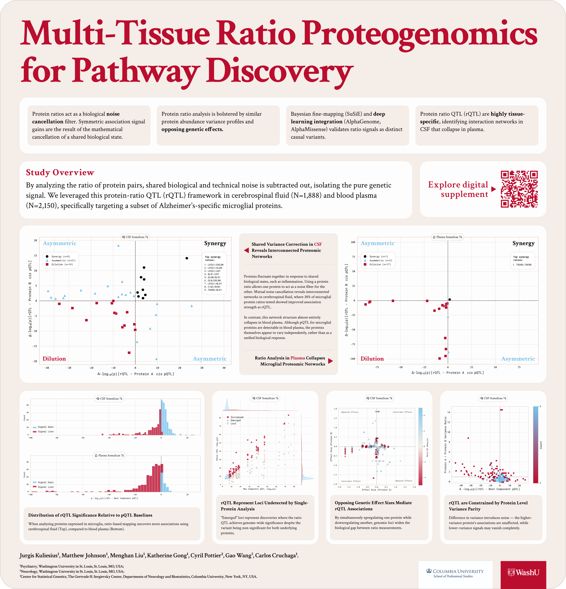

## About

This interactive resource accompanies Poster P17.18LB: Multi-tissue Ratio Proteogenomics for Pathway Discovery, presented at the 2026 US HUPO (Human Proteome Organization) Conference.

The work was conducted by the Cruchaga Lab at Washington University in St. Louis. [Cruchaga Lab](https://cruchagalab.wustl.edu/)

### Lead Analyst:
Jurgis Kuliesius, PhD

### Principal Investigator:
Prof. Carlos Cruchaga, PhD

### Collaborators:
Gao Wang, PhD (Asst. Prof, Columbia University) - Statistical methodology;
Matthew Johnson, MS; Cyril Pottier, PhD (Asst. Prof.) - Genetics data;
Menghan Liu, MS; Katherine Gong, MS - Phenotypic data.

::: details How to cite?
Please refer to the accompanying abstract/poster:
> Kuliesius, J., et al. "Multi-tissue Ratio Proteogenomics for Pathway Discovery." Poster P17.18LB, US HUPO Conference 2026.
:::

::: details Have questions?
Contact at jurgis@wustl.edu
:::

